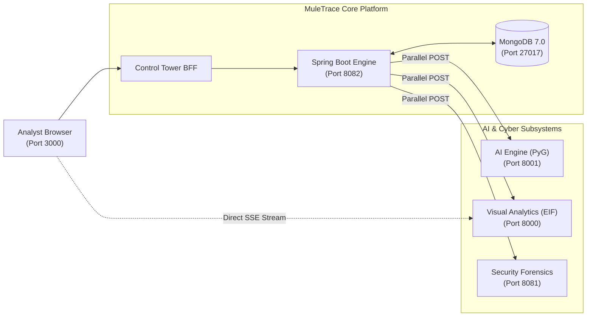

# 🛡️ MuleTrace — Real-Time Money Mule & Financial Fraud Intelligence Platform

> **TECHFORGE 2026 — FINAL SUBMISSION**  
> **Stopping coordinated money mule networks and layered illicit flows before cash-out.**

---

## 📌 TECHFORGE 2026 — SUBMISSION DETAILS

### 1. Team Details
- **Team Name:** AI Took My Job
- **Team Members:**
  - **Aditya Jha** (Lead Full-Stack, Graph ML & Distributed Systems Engineer) — [GitHub](https://github.com/Aditya-hub28) | adityacareer12@gmail.com

### 2. Problem Statement
- **Problem Statement Name:** AI-Powered Financial Fraud & Money Mule Network Detection
- **Selected Domain:** FinTech / Cybersecurity / Artificial Intelligence & Machine Learning

### 3. Project Details
- **Project Title:** MuleTrace (Mule Hunter) — Defense-in-Depth Financial Crime Prevention Platform
- **Short Description:** MuleTrace is a real-time anti-money-laundering (AML) platform designed to detect layered mule accounts, circular fund flows, and synthetic cyber identities across high-volume payment networks. By fusing Graph Neural Networks (GraphSAGE + GAT), Extended Isolation Forest (EIF) behavioral anomaly profiling, and TLS JA3 cyber-fingerprinting into a sub-15ms multi-modal Risk Fusion engine, it flags coordinated syndicates with 0.9906 AUC-ROC. The platform equips compliance teams with an interactive 3D WebGL network galaxy displaying 24 orbital mule rings, automated BFS money flow tracing, an optimal Freeze Frontier recovery engine, and an immutable Proof-of-Work Merkle-tree audit ledger.

### 4. GitHub Repository
- **GitHub Repository Link:** [https://github.com/Aditya-hub28/Ai_took_my_job_techforge2026](https://github.com/Aditya-hub28/Ai_took_my_job_techforge2026)
- **Collaborations Configured:**
  - ✅ [TSEC ACM](https://github.com/acmco)
  - ✅ [CodeCrafters](https://github.com/codecrafters-tsec)

---

## 📖 1. Project Overview

In global banking and high-velocity instant payment rails (such as India's UPI, processing over 500+ crore transactions monthly), financial crime syndicates exploit fragmented mule account topologies. Fraudsters launder funds using rapid multi-hop dispersion, layered circular hops, and shared automated bot infrastructure to defeat account-level heuristic checks.

Traditional rule-based fraud detection evaluates transactions in isolation and is structurally blind to network-level topology. **MuleTrace** reframes financial crime detection from *"does this individual transaction look suspicious?"* to *"does this entire multi-hop web of relationships, temporal bursts, and cyber signatures represent an organized mule network?"*

```
                       ┌──────────────────────────────┐
                       │  Incoming Payment / Webhook  │
                       └──────────────┬───────────────┘
                                      │
                   ┌──────────────────┴──────────────────┐
                   ▼                                     ▼
        ┌──────────────────────┐              ┌──────────────────────┐
        │ Deep Graph Topology  │              │ Behavioral Profiling │
        │  GraphSAGE + 4-Head  │              │  Extended Isolation  │
        │    GAT (Weight: 40%) │              │   Forest (Weight: 20%)│
        └──────────┬───────────┘              └──────────┬───────────┘
                   │                                     │
                   ├──────────────────┬──────────────────┤
                   ▼                  ▼                  ▼
        ┌──────────────────────┐ ┌─────────┐ ┌──────────────────────┐
        │  Velocity & Burst    │ │ Graph   │ │  Cyber JA3 & Device  │
        │  Scoring (Weight: 25%)│ │ Density │ │ Fingerprint (Weight: 5%)
        └──────────┬───────────┘ └────┬────┘ └──────────┬───────────┘
                   │                  │                 │
                   └──────────────────┼─────────────────┘
                                      ▼
                      ┌────────────────────────────────┐
                      │ 5-Factor Real-Time Risk Fusion │
                      │       Sub-15ms Decision        │
                      └───────────────┬────────────────┘
                                      │
                 ┌────────────────────┴────────────────────┐
                 ▼                                         ▼
         [APPROVE / REVIEW]                              [BLOCK]
                                                           │
                                      ┌────────────────────┴────────────────────┐
                                      ▼                                         ▼
                         ┌─────────────────────────┐               ┌─────────────────────────┐
                         │ Autonomous AI Case File │               │ Tamper-Evident PoW      │
                         │ 11-Tool Agent Triage    │               │ Merkle-Tree Audit Block │
                         └────────────┬────────────┘               └─────────────────────────┘
                                      │
                                      ▼
                         ┌─────────────────────────┐
                         │ Money Flow BFS DAG &    │
                         │ Freeze Frontier Cut     │
                         └─────────────────────────┘
```

---

## ✨ 2. Key Features

### 🧠 1. Hybrid Graph Neural Network (GNN Engine)
- Combines **GraphSAGE** (inductive neighborhood aggregation) and **4-Head Graph Attention Networks (GAT)** to pass messages across 21 topological graph features.
- Captures non-linear multi-hop relationships, PageRank centrality, clustering coefficients, and 2-hop fraud neighborhood densities in $< 5$ms.

### 🌲 2. Extended Isolation Forest (EIF) & TreeSHAP Explainability
- Employs **Extended Isolation Forest (`ExtensionLevel=1`)** with random-slope hyperplanes to eliminate scoring blind spots caused by axis-aligned standard isolation trees.
- Extracts 14 cross-feature interaction attributes and streams real-time local **TreeSHAP** feature attribution waterfalls to compliance officers via Server-Sent Events (SSE).

### ⚡ 3. 5-Signal Real-Time Risk Fusion
- Evaluates transactions via a deterministic mathematical fusion pipeline:
  $$\text{Risk} = \min(0.40 \cdot \text{GNN} + 0.20 \cdot \text{EIF} + 0.25 \cdot \text{Behavior} + 0.10 \cdot \text{GraphDensity} + 0.05 \cdot \text{JA3}, 1.0)$$
- Yields immediate, explainable automated verdicts:
  - $\text{Risk} \ge 0.75 \implies$ **`BLOCK`** (Auto-Investigation Triggered)
  - $0.45 \le \text{Risk} < 0.75 \implies$ **`REVIEW`** (Flagged for Analyst Verification)
  - $\text{Risk} < 0.45 \implies$ **`APPROVE`** (Instant Clearing)

### 🌀 4. 24 Circular Mule Rings & Community Cluster Detection
- Automated DFS cycle-finding identifies directed circular money loops (length 3 to 6 hops).
- Louvain modularity partitions the global network into dense syndicates operating coordinated smurfing rings.

### 🌐 5. Interactive 3D WebGL Network Galaxy
- Three.js and `react-force-graph-3d` visualization mapping 1,000+ financial entities across a **Fibonacci spherical lattice**.
- Highlights **24 distinct circular mule rings in glowing neon orbital paths** with translucent directed transaction arrows, accompanied by a slide-over account inspector.

### ❄️ 6. Money Flow DAG & Optimal Freeze Frontier
- Breadth-First Search (BFS) DAG traversal traces the dispersion of stolen funds downstream while validating conservation of capital.
- Computes the **Freeze Frontier**: the mathematically optimal set of downstream accounts holding $\ge 15\%$ unspent funds, enabling maximum asset recovery with minimal customer disruption.

### 🤖 7. Autonomous 11-Tool AI Investigation Agent
- Instantly triggers an investigative workflow when fraud is flagged, querying:
  `get_account_profile`, `get_transactions`, `analyze_behavior`, `expand_network`, `get_shared_devices`, `get_shared_ips`, `detect_rings`, `analyze_temporal_patterns`, `trace_money`, `get_freeze_frontier`, and `generate_investigation_summary`.
- Features an interactive **Copilot Drawer** for natural-language forensic triage.

### ⛓️ 8. Tamper-Evident Proof-of-Work Merkle Ledger
- Internal blockchain ledger with Proof-of-Work mining (`difficulty = 4`, targeting `"0000"` prefix) and SHA-256 Merkle root computation.
- Guarantees regulatory non-repudiation and includes an active tampering demonstration endpoint to prove cryptographic audit integrity.

### 📄 9. One-Click Compliance PDF Generation
- Generates official, court-admissible forensic case files and system benchmark reports as binary PDFs using OpenPDF.

---

## 🛠️ 3. Technology Stack

| Layer | Technology | Exact Version | Purpose |
| :--- | :--- | :--- | :--- |
| **Frontend** | Next.js (App Router) | `16.0.10` | Analyst Control Tower SPA & SSR |
| **Frontend UI** | React / TypeScript | `19.2.1` / `^5` | Component tree & type safety |
| **3D Graphics** | Three.js / React Force Graph | `^0.183.2` / `^1.24.4`| 3D WebGL Spherical Network Visualizer |
| **Styling** | Tailwind CSS / Lucide Icons | `^4` / `^1.16.0` | Dark-mode cybernetic dashboard UI |
| **Core Backend** | Java OpenJDK | `17 (LTS)` | High-throughput backend execution |
| **Framework** | Spring Boot WebFlux | `3.2.5` | Non-blocking reactive orchestration |
| **Security** | Spring Security + JJWT | `0.11.5` | Stateless JWT & Role-Based Access Control |
| **Reporting** | OpenPDF (LibrePDF) | `1.3.39` | Binary audit report & metrics PDF generation |
| **Database** | MongoDB Community Server | `7.0.14` | Persistent document & graph edge storage |
| **AI / GNN** | PyTorch & PyTorch Geometric | `2.3.1` / `2.5.3` | Deep learning message passing on graph |
| **Graph API** | FastAPI / Uvicorn | `0.111.0` / `0.30.1` | REST microservice exposing GNN inference |
| **Anomaly ML** | Extended Isolation Forest (EIF)| `2.0.2` | Hyperplane behavioral anomaly detection |
| **Explainability** | SHAP (TreeSHAP) | `0.45.0` | Local feature attribution vectors |
| **Cyber / Ledger**| Java Spring Boot | `3.2.0` | TLS JA3 bot detection & Merkle blockchain |

---

## 🏗️ 4. Architecture & Workflow

### Service & Port Allocations
- `control-tower`: **Port 3000** (Next.js 16 Web Application)
- `backend`: **Port 8082** (Spring Boot 3.2.5 Core Orchestrator)
- `ai-engine`: **Port 8001** (FastAPI / PyTorch Geometric GNN Engine)
- `visual-analytics`: **Port 8000** (FastAPI / Extended Isolation Forest & SHAP)
- `security-forensics`: **Port 8081** (Spring Boot Cyber Forensics & Blockchain)
- `mongodb`: **Port 27017** (`muletrace_auth` database)



---

## 📊 5. Dataset & Benchmark Performance

### Verified Benchmarks (IEEE-CIS Fraud Dataset)
MuleTrace was trained and benchmarked on the comprehensive **IEEE-CIS Financial Dataset** (590,540 real transactions mapped into 14,318 account nodes and 75,488 edges):

```
┌──────────────────┬──────────────────┬──────────────────┬──────────────────┐
│     AUC-ROC      │     F1 Score     │    Precision     │      Recall      │
│     0.9906       │      0.8604      │      0.8669      │      0.8539      │
│  Target >0.90 ✓  │  Target >0.80 ✓  │  1.9% False Pos  │  85.4% Captured  │
├──────────────────┼──────────────────┼──────────────────┼──────────────────┤
│  Inference Time  │  Rings Detected  │   Active Graph   │  Training Time   │
│   < 15ms Total   │    24 Pre-Set    │   1,000+ Nodes   │   ~26 min (CPU)  │
└──────────────────┴──────────────────┴──────────────────┴──────────────────┘
```

### Master API Endpoint Inventory

| Microservice | Method | Endpoint Path | Description |
| :--- | :--- | :--- | :--- |
| **Backend Core** | `POST` | `/api/transactions/process` | Evaluates incoming transaction through the 5-factor Risk Fusion pipeline |
| **Backend Core** | `GET` | `/api/transactions/recent` | Retrieves recent transaction ledger with risk scores and decisions |
| **Backend Core** | `POST` | `/api/investigations/start` | Triggers the autonomous 11-tool AI investigation on a target account |
| **Backend Core** | `GET` | `/api/investigations/{id}` | Returns complete investigation case file, evidence timeline, and frontier |
| **Backend Core** | `POST` | `/api/investigations/query` | Natural-language query interface for the Investigation Copilot |
| **Backend Core** | `GET` | `/api/graph/network` | Fetches global 3D graph topology with Fibonacci spherical coordinates |
| **Backend Core** | `GET` | `/api/graph/subgraph/{id}` | Retrieves focused 2-hop ego network for a specific investigated account |
| **Backend Core** | `GET` | `/api/audit/investigation/{id}/pdf` | Generates and streams official case investigation audit report as binary PDF |
| **Backend Core** | `GET` | `/api/admin/evaluation/pdf` | Compiles and downloads system benchmark evaluation report as binary PDF |
| **AI Engine** | `POST` | `/v1/gnn/score` | Real-time PyG `MuleTraceGNN` inductive node classification forward pass |
| **AI Engine** | `GET` | `/detect-rings` | Returns DFS-identified directed cyclic money mule loops |
| **Visual Analytics**| `POST` | `/v1/eif/score` | Computes Extended Isolation Forest anomaly score and TreeSHAP values |
| **Visual Analytics**| `GET` | `/visual-analytics/api/visual/stream/unsupervised` | Server-Sent Events (SSE) live anomaly detection telemetry stream |
| **Security Forensics**| `POST`| `/api/security/ja3-risk` | Evaluates TLS Client Hello JA3 fingerprint against known bot databases |
| **Security Forensics**| `POST`| `/api/security/identity-forensics`| Evaluates device fingerprint and IP infrastructure reuse across accounts |
| **Security Forensics**| `POST`| `/api/security/log-fraud` | Commits confirmed fraudulent transaction to the Proof-of-Work blockchain |
| **Security Forensics**| `GET` | `/api/security/blockchain/verify` | Cryptographically verifies the integrity of all mined blocks and Merkle roots |
| **Security Forensics**| `POST`| `/api/security/blockchain/tamper` | Active audit test demonstrating tamper detection on block headers |

---

## 💻 6. Setup & Installation Instructions

### Prerequisites
- **Operating System:** Windows 10/11, macOS, or Linux
- **Java:** OpenJDK 17 LTS (`java -version`)
- **Python:** Python 3.11 (`python --version`)
- **Node.js:** Node v18+ or v20+ (`node --version`)
- **Database:** MongoDB 7.0 (`mongod --version`)

---

### Step-by-Step Local Deployment

#### 1. Clone the Repository
```bash
git clone https://github.com/Aditya-hub28/Ai_took_my_job_techforge2026.git
cd Ai_took_my_job_techforge2026
```

#### 2. Start MongoDB (Port 27017)
```bash
# Start MongoDB daemon locally
mongod --dbpath ./data/db --port 27017 --bind_ip 127.0.0.1
```

#### 3. Launch AI Engine (Port 8001)
```bash
cd ai-engine
python -m venv .venv
# Windows:
.\.venv\Scripts\Activate.ps1
# Linux/macOS:
# source .venv/bin/activate

pip install -r requirements.txt
python -m uvicorn inference_service:app --host 0.0.0.0 --port 8001
```

#### 4. Launch Visual Analytics (Port 8000)
```bash
cd visual-analytics/eif_v_2
python -m venv .venv
# Windows:
.\.venv\Scripts\Activate.ps1
# Linux/macOS:
# source .venv/bin/activate

pip install -r requirements.txt
python -m uvicorn app.main:app --host 0.0.0.0 --port 8000
```

#### 5. Launch Security Forensics (Port 8081)
```bash
cd security-forensics
# Ensure JAVA_HOME is set to JDK 17
mvn clean package -DskipTests
java -jar target/security-forensics-1.0.0.jar
```

#### 6. Launch Backend Core (Port 8082)
```bash
cd backend
# Ensure JAVA_HOME is set to JDK 17
mvn clean package -DskipTests
java -jar target/backend-0.0.1-SNAPSHOT.jar
```

#### 7. Launch Control Tower Frontend (Port 3000)
```bash
cd control-tower
npm install
npm run dev
```

Open your browser at **`http://localhost:3000`**.

---

### Default Demo Credentials
- **Admin Access:** `admin@muletrace.io` / `adminPass123` (Role: `ROLE_ADMIN`)
- **Analyst Access:** `user@test.com` / `userPassword` (Role: `ROLE_ANALYST`)
- **Auditor Access:** `auditor@muletrace.io` / `auditorPass123` (Role: `ROLE_AUDITOR`)

---

## 🖥️ 7. Screenshots & Demo Walkthrough

The Control Tower user interface is divided into dedicated forensic modules accessible via the navigation bar:

1. **Live Transaction Simulator (`/transaction` & `/dashboard` Tab 1):** Inject synthetic transaction vectors with custom velocities, device IDs, and amounts to observe real-time sub-15ms Risk Fusion evaluation.
2. **Interactive 3D Fraud Galaxy (`/network`):** WebGL force-directed sphere rendering 1,000+ accounts. Click any node to open the **Node Detail Drawer** displaying account balance, KYC status, risk badges, and direct links to start an investigation.
3. **24 Orbital Mule Rings View (`/network` Filters):** Toggle the "Fraud Rings Only" view to isolate the 24 circular smurfing rings orbiting cleanly in translucent green and red neon paths.
4. **Visual Analytics Waterfall (`/transaction`):** Real-time Server-Sent Events (SSE) telemetry rendering dynamic SHAP value waterfall charts highlighting behavioral anomalies.
5. **AI Investigation Copilot (`/dashboard` Tab 11):** Autonomous case triage detailing the 11 forensic tool execution steps, chronological evidence timeline, and recommended actions.
6. **Recovery & Freeze Frontier (`/dashboard` Tab 10):** Visual money flow DAG detailing downstream capital dispersion and candidate freeze accounts holding $\ge 15\%$ unspent funds.
7. **Tamper-Evident Blockchain Ledger (`/dashboard` Tab 8):** Inspect mined blocks, hash linkages, and test the `/tamper` simulation button to demonstrate real-time cryptographic audit failure alerts.
8. **Compliance PDF Export (`/stats` & `/dashboard`):** Download court-admissible PDF audit reports compiled directly via OpenPDF.

---

## ⚠️ 8. Limitations & Future Scope

### Current Limitations
- **In-Memory Ledger Persistence:** The Proof-of-Work blockchain and JA3 identity store run in-memory within the `security-forensics` microservice; service restarts re-initialize the ledger history.
- **Deterministic Copilot Queries:** The Copilot drawer resolves natural-language inquiries via regex intent mapping rather than a third-party paid LLM API, ensuring 100% deterministic local execution without API key requirements.
- **GPU Scaling on Integrated Graphics:** The 3D WebGL network graph renders smoothly on modern GPUs, but rendering $> 2,000$ active nodes with real-time particle animations may introduce frame-rate throttling on legacy integrated chipsets.

### Future Scope
- **Temporal Graph Networks (TGN):** Upgrading the static PyG architecture to continuous-time dynamic graph learning to capture sub-second edge modifications during active bank runs.
- **Enterprise Ledger Integration:** Connecting the internal Proof-of-Work engine to an enterprise distributed ledger (e.g., Hyperledger Fabric) for cross-institutional banking consortium reporting.
- **Federated Privacy-Preserving AML:** Introducing Federated Learning (FL) across independent banking institutions to train collective mule-detection models without sharing proprietary customer PII.

---

## 👥 9. Team Members & Acknowledgements

### Team "AI Took My Job"
- **Aditya Jha** — *Lead Developer, Machine Learning & Systems Architect*  
  GitHub: [@Aditya-hub28](https://github.com/Aditya-hub28) | Email: [adityacareer12@gmail.com](mailto:adityacareer12@gmail.com)

### Acknowledgements & Hackathon Details
- **Hackathon:** TECHFORGE 2026
- **Organizers:** Thadomal Shahani Engineering College (TSEC) ACM Student Chapter & CodeCrafters TSEC
- **Collaborator Handles:**
  - [TSEC ACM (`acmco`)](https://github.com/acmco)
  - [CodeCrafters (`codecrafters-tsec`)](https://github.com/codecrafters-tsec)

---

<div align="center">
  <b>MuleTrace — Because every fraudster leaves a trace in the graph.</b><br/>
  <i>Engineered for TECHFORGE 2026</i>
</div>
